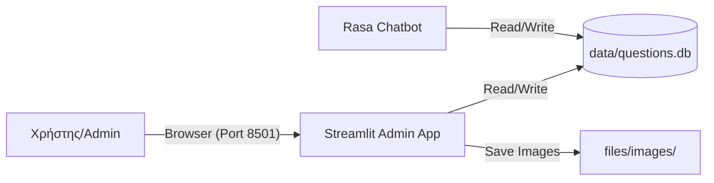

# Τεχνική Υλοποίηση Admin App (Implementation Guide)

Αυτό το έγγραφο περιγράφει την τεχνική αρχιτεκτονική και τον κώδικα πίσω από την εφαρμογή διαχείρισης (`admin_app.py`).

---

## 1. Τεχνολογίες
*   **Python:** Γλώσσα προγραμματισμού.
*   **Streamlit:** Framework για τη δημιουργία web εφαρμογών δεδομένων γρήγορα και εύκολα.
*   **SQLite3:** Για τη σύνδεση με τη βάση δεδομένων του Rasa.
*   **Pandas:** Για τη διαχείριση και την απεικόνιση των δεδομένων σε πίνακα (Dataframe).

---

## 2. Αρχιτεκτονική & Ροή Δεδομένων

Η εφαρμογή λειτουργεί ανεξάρτητα από τον Rasa Server, αλλά μοιράζεται την ίδια πηγή δεδομένων.



### Βασικά Σημεία:
1.  **Shared Volume:** Στο Docker, both το `rasa-server` και το `admin-app` έχουν mounted τον φάκελο `./data`. Έτσι, ό,τι γράφει ο ένας, το βλέπει ο άλλος.
2.  **Concurrency:** Η SQLite επιτρέπει ταυτόχρονες αναγνώσεις, αλλά κλειδώνει τη βάση κατά την εγγραφή. Για την κλίμακα του σχολείου, αυτό είναι επαρκές.

---

## 3. Ανάλυση Κώδικα (`admin_app.py`)

### Α. Σύνδεση με Βάση
Η συνάρτηση `init_db()` ελέγχει αν υπάρχει ο πίνακας `questions`. Αν όχι, τον δημιουργεί. Επίσης, κάνει checks για migration (π.χ. αν λείπει η στήλη `image_path`, την προσθέτει).

```python
def init_db():
    conn = sqlite3.connect(DB_PATH)
    # ... Create table IF NOT EXISTS ...
```

### Β. Φίλτρα & Αναζήτηση (Dynamic Querying)
Χρησιμοποιούμε **SQL Parameterized Queries** για ασφάλεια (αποφυγή SQL Injection) και δυναμικό φιλτράρισμα.

Ο κώδικας χτίζει το query βήμα-βήμα:
1.  Ξεκινάει με `SELECT * FROM questions WHERE 1=1`.
2.  Αν ο χρήστης επιλέξει μάθημα, προσθέτει `AND subject = ?`.
3.  Αν γράψει κείμενο, προσθέτει `AND question_text LIKE ?`.

```python
if selected_subject != "Όλα":
    query += " AND subject = ?"
    params.append(selected_subject)
```

### Γ. Προβολή Δεδομένων
Χρησιμοποιούμε το `st.dataframe(df)` του Streamlit, το οποίο προσφέρει out-of-the-box δυνατότητες ταξινόμησης (click headers) και scrolling.

### Δ. Διαγραφή Ερωτήσεων
Για τη διαγραφή, χρησιμοποιούμε ένα `st.expander` για να μην πιάνει χώρο όταν δεν χρειάζεται.
1.  Φορτώνουμε ξανά τα ID και Subject των ερωτήσεων.
2.  Ο χρήστης επιλέγει από `st.selectbox`.
3.  Με το πάτημα του κουμπιού, εκτελείται `DELETE FROM questions WHERE id = ?`.
4.  Καλούμε `st.rerun()` για να ανανεωθεί άμεσα η σελίδα.

---

## 4. Docker Deployment

Για να τρέξει στον Server, δημιουργήσαμε ένα ξεχωριστό service στο `docker-compose.yml`.

```yaml
  admin-app:
    build: .  # Χρησιμοποιεί το ίδιο Image με το Rasa (έχει ήδη Python/Streamlit)
    entrypoint: [] # Ακυρώνουμε το default entrypoint του Rasa
    command: streamlit run admin_app.py --server.port 8501 --server.address 0.0.0.0
    ports:
      - "8501:8501"
    volumes:
      - ./data:/app/data   # Κοινή Βάση
      - ./files:/app/files # Κοινά Αρχεία
```

Αυτό εξασφαλίζει ότι το Admin App "βλέπει" ακριβώς τα ίδια δεδομένα με το Chatbot.
